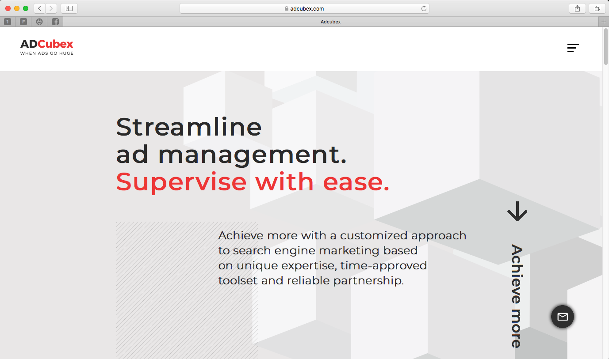
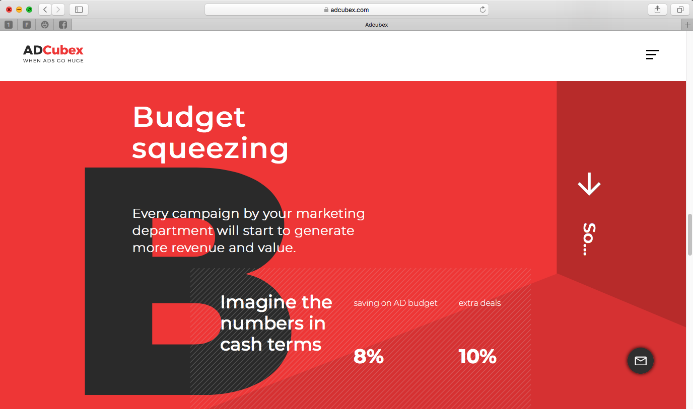

# Adcubex Landing

<p align="left">
   <a rel="license" href="http://creativecommons.org/licenses/by-nc-nd/4.0/"></a><br /><br />
</p>

> advertising, digital advertising, digital marketing, worldwide advertising

## Introduction

A standalone landing page





## Installation and start
First step is to install all site dependencies:
```
$ npm install
```

You have possibility to build and start standalone instance of site with browser-sync:
```
$ npm run start
```
or build static sources for production env via following command:
```
$ npm run build
```

After that check `./build` folder.

## Testing

Start unit tests using following command:
```
$ npm run test
```

After test completion you can check coverage report here: `./coverage/lcov-report/index.html`

## Code Style

Format code via prettier and check statics via eslint
```
$ npm run format
$ npm run lint
```
## Note

The project has template engine. Use absolute path for correct work of static files and link.

